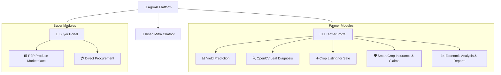
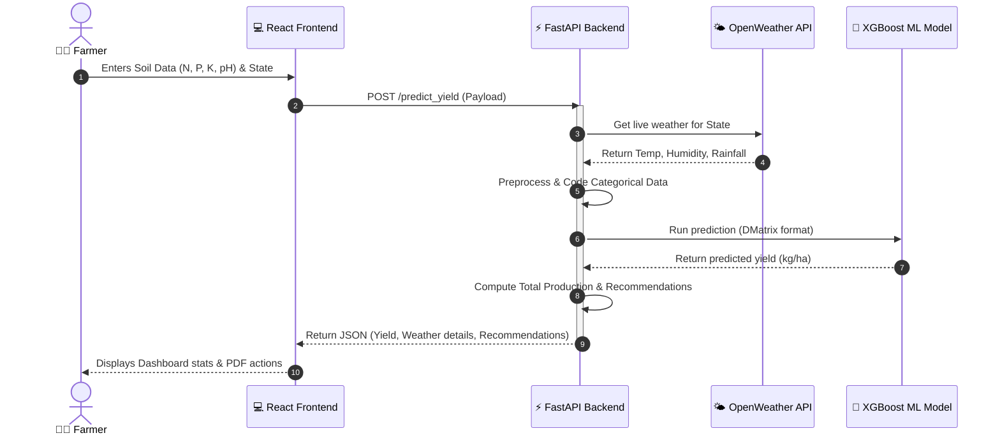

# 🌾 AgroAI

[](https://react.dev/)
[](https://fastapi.tiangolo.com/)
[](https://www.python.org/)
[](https://xgboost.readthedocs.io/)
[](https://opencv.org/)
[](https://deepmind.google/technologies/gemini/)

[](https://opensource.org/licenses/MIT)
[](https://github.com/Rhythem2005/SIH-CROP-YIELD-/stargazers)
[](https://github.com/Rhythem2005/SIH-CROP-YIELD-/commits)

AgroAI is a smart agricultural platform that helps farmers make data-driven decisions. It combines machine learning for crop yield prediction, computer vision for plant health analysis, and an AI chatbot for farming advice — delivering actionable, localized insights that maximize productivity, prevent crop loss, and enable peer-to-peer produce trade.

---

## 🌟 Key Features

- 📊 **Crop Yield Prediction**: Estimates crop yield using a trained **XGBoost model**, factoring in soil nutrients (N, P, K, pH), rainfall, and live weather data fetched automatically.
- 🔍 **Disease & Health Analysis**: Upload a leaf image to instantly detect nitrogen deficiency, fungal disease, or drought stress via **OpenCV color-ratio (HSV) analysis**.
- 🌾 **Kisan Mitra Chatbot**: A friendly farming assistant powered by Google's **Gemini AI**, answering agricultural questions in English, Hindi, and Hinglish.
- 🛍️ **P2P Marketplace**: Connects farmers directly with buyers — farmers list crops and set prices, buyers browse local, fresh produce.
- 🛡️ **Smart Insurance & Claims**: Get customized crop insurance recommendations and submit claims based on yield predictions and weather hazards.
- 📋 **Economic Reports**: Generate downloadable PDF reports summarizing soil conditions, predicted yield, weather forecast, and tailored farming tips.
- 🌐 **Multilingual Support**: Switch seamlessly between English and Hindi for a localized, inclusive user experience.

---

## 🏗️ Tech Stack

| Layer | Technologies |
|--------|--------------|
| **Frontend** | React (Vite), Tailwind CSS, Lucide Icons |
| **Backend** | FastAPI, Uvicorn, Python 3.10+ |
| **Machine Learning** | XGBoost, Scikit-learn, Pandas, NumPy |
| **Computer Vision** | OpenCV (HSV color-space segmentation) |
| **AI Integration** | Google Gemini 2.0 Flash |
| **External APIs** | OpenWeather API |

---

## 📐 Architecture & Diagrams

The diagrams below outline AgroAI's system architecture, feature map, and API lifecycle.

### 1. High-Level System Architecture

```text
                                  AgroAI Platform Architecture
                                  
     ┌──────────────────────────────────────────────────────────────────────────────────┐
     │                                React (Vite) Frontend                              │
     └────────────────────────────────────────┬─────────────────────────────────────────┘
                                              │ REST API
                                              ▼
     ┌──────────────────────────────────────────────────────────────────────────────────┐
     │                                 FastAPI Backend                                  │
     └───┬─────────────────────┬───────────────────────┬──────────────────────┬─────────┘
         │                     │                       │                      │
         ▼                     ▼                       ▼                      ▼
┌──────────────────┐  ┌──────────────────┐  ┌────────────────────┐  ┌────────────────────┐
│  XGBoost Model   │  │ OpenCV Analysis  │  │  Gemini 2.0 AI     │  │  OpenWeather API   │
│ (Yield Predict)  │  │ (Leaf Diagnosis) │  │ (Kisan Mitra Chat) │  │  (Live Data Fetch) │
└──────────────────┘  └──────────────────┘  └────────────────────┘  └────────────────────┘
```

### 2. Platform Feature Map



### 3. API Execution Lifecycle



---

## 📂 Project Structure

```text
SIH-CROP-YIELD-/
├── client/                     # React Frontend (Vite)
│   ├── src/                    # Components, pages, context, & styles
│   ├── public/                 # Static assets
│   ├── package.json            # Node dependencies
│   └── vite.config.js          # Vite configuration
│
├── server/                     # FastAPI Backend
│   ├── app.py                  # Core REST API endpoints & route handlers
│   ├── crop_yield_model.json   # Pre-trained XGBoost ML model
│   ├── requirements.txt        # Python dependencies
│   └── .env.example            # Environment template
│
├── INTERVIEW_PREPARATION.md    # Comprehensive interview prep guide
└── README.md                   # Project documentation
```

---

## 🚀 Getting Started

### Clone the Repository

```bash
git clone https://github.com/Rhythem2005/SIH-CROP-YIELD-.git
cd SIH-CROP-YIELD-
```

### Backend Setup

```bash
cd server

# Create and activate virtual environment
python -m venv venv

# Linux / macOS
source venv/bin/activate

# Windows
venv\Scripts\activate

# Install dependencies
pip install -r requirements.txt

# Configure environment variables
cp .env.example .env

# Start FastAPI server
uvicorn app:app --reload
```

Backend runs at `http://127.0.0.1:8000`

---

### Frontend Setup

```bash
cd client

# Install dependencies
npm install

# Start development server
npm run dev
```

Frontend runs at `http://localhost:5173`

---

## 🔑 Environment Variables

### Server (`server/.env`)

```env
GEMINI_KEY=your_gemini_api_key
OPENWEATHER_KEY=your_openweather_api_key
ALLOWED_ORIGINS=http://localhost:5173
```

### Client (`client/.env`)

```env
VITE_API_URL=http://127.0.0.1:8000
VITE_OPENWEATHER_KEY=your_openweather_api_key
```

---

## 📡 API Endpoints Summary

| Method | Endpoint | Description |
|---------|----------|-------------|
| `POST` | `/predict_yield` | Predicts crop yield from soil nutrients & state weather |
| `POST` | `/analyze_crop_image` | Diagnoses plant leaf health using OpenCV color masks |
| `POST` | `/api/chat` | AI chatbot powered by Google Gemini 2.0 Flash |

---

## 💡 Developer Notes

> [!IMPORTANT]
> **Authentication**: The JWT-based authentication system is currently bypassed in `app.py` for testing simplicity and faster local validation.
>
> **Model Path**: The trained `crop_yield_model.json` file must exist in the root of the `server/` directory for `/predict_yield` requests to resolve successfully.
>
> **Computer Vision**: Leaf disease/health analysis relies on color mapping and threshold masking (HSV ratios) rather than a deep learning Convolutional Neural Network (CNN). It provides a fast, client-friendly color approximation.

---

## 📄 License

This project is licensed under the [MIT License](LICENSE) — free to use, modify, and build on.

---

<div align="center">

Built with ❤️ by <a href="https://github.com/Rhythem2005">Rhythem</a>

</div>
