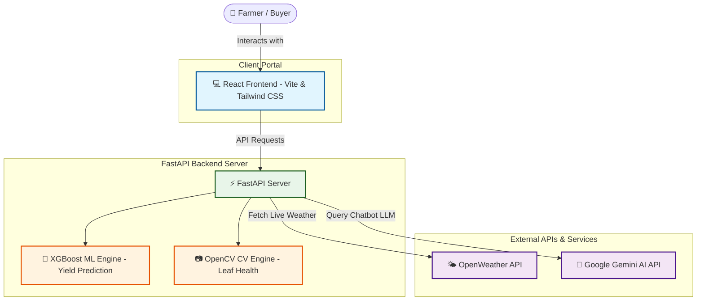
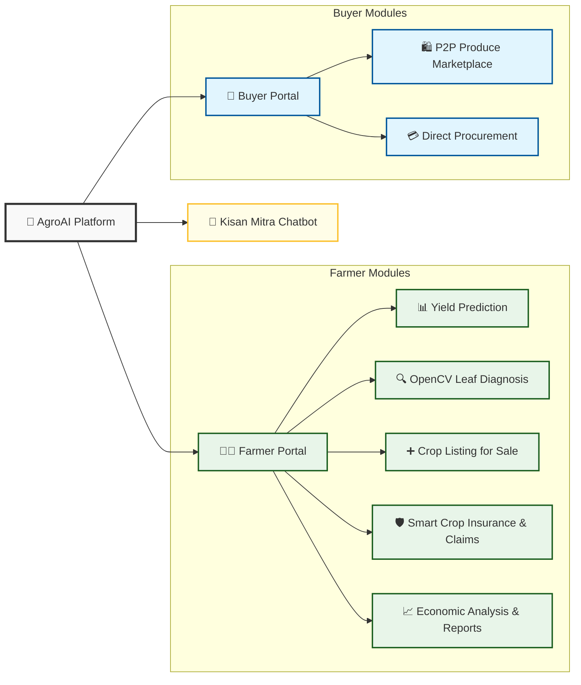
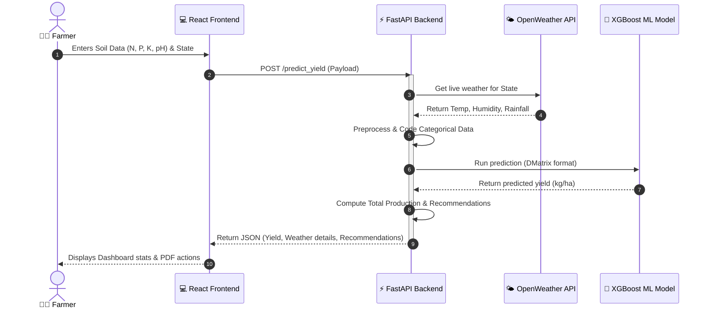

# AgroAI: Crop Prediction & Image Analysis

[](https://react.dev/)
[](https://fastapi.tiangolo.com/)
[](https://xgboost.readthedocs.io/)
[](https://opencv.org/)
[](https://deepmind.google/technologies/gemini/)
[](https://opensource.org/licenses/MIT)

AgroAI is a smart agricultural platform designed to help farmers make data-driven decisions. By combining machine learning for crop yield prediction, computer vision for plant health analysis, and an AI chatbot for farming advice, AgroAI provides actionable, localized insights to maximize productivity, prevent crop loss, and manage peer-to-peer commerce.

---

## 🗺️ System Architecture & Workflow

To help understand how AgroAI functions, the diagrams below outline the application's underlying architecture, core feature maps, and API lifecycle.

### 1. High-Level Architecture
This diagram displays the interaction between the React frontend, FastAPI backend, ML models, and external APIs.



### 2. Platform Feature Map
AgroAI split features between **Farmers** (for cultivation metrics and sales listing) and **Buyers** (for procurement and trade).



### 3. API Execution Lifecycle
The following sequence demonstrates how a crop yield prediction triggers live weather fetching and runs through our ML model:



---

## ✨ Features

- 📊 **Crop Yield Prediction**: Estimates crop yield using a trained **XGBoost model**, taking into account soil nutrients (N, P, K, pH), rainfall, and live weather data fetched automatically.
- 🔍 **Disease & Health Analysis**: Upload leaf images to instantly detect signs of nitrogen deficiency, fungal diseases, or drought stress via **OpenCV color ratio (HSV) analysis**.
- 🌾 **Kisan Mitra Chatbot**: An intelligent, friendly farming assistant powered by Google's **Gemini AI**, answering agricultural questions in English, Hindi, and Hinglish.
- 🛍️ **P2P Marketplace**: Connects farmers directly with buyers. Farmers can list crops and set prices, while buyers can browse local fresh produce.
- 🛡️ **Smart Insurance & Claims**: Get customized crop insurance recommendations and submit claims directly based on yield predictions and weather hazards.
- 📋 **Economic Reports**: Generate downloadable PDF reports summarizing soil conditions, predicted yield, weather forecasts, and customized farming tips.
- 🌐 **Multilingual Support**: Switch seamlessly between English and Hindi for a localized, inclusive user experience.

---

## 🛠️ Tech Stack

| Component | Technology | Description |
| :--- | :--- | :--- |
| **Frontend** | React (Vite), Tailwind CSS, Lucide Icons, i18next | Responsive, modern, multilingual dashboard interface. |
| **Backend** | FastAPI, Python, Uvicorn | High-performance asynchronous API server. |
| **Data & ML** | XGBoost, Pandas, NumPy, Scikit-learn | ML regression models and data preprocessing. |
| **Vision** | OpenCV (HSV Masking & Color Ratios) | Automated detection of crop color abnormalities. |
| **Generative AI** | Google Generative AI (Gemini 2.0 Flash) | Natural language processing for Kisan Mitra Chatbot. |
| **APIs** | OpenWeather API | Dynamic, real-time local weather details. |

---

## 🚀 How to Run Locally

### 1. Clone the repository
```bash
git clone https://github.com/Rhythem2005/SIH-CROP-YIELD-.git
cd SIH-CROP-YIELD-
```

### 2. Set up the Backend
```bash
cd server
python -m venv venv
source venv/bin/activate  # On Windows use: venv\Scripts\activate
pip install -r requirements.txt
```

1. Create a `.env` file in the `server` folder using `.env.example` as a template.
2. Fill in your API keys (OpenWeather, Gemini):
   ```env
   GEMINI_KEY=your_gemini_api_key_here
   OPENWEATHER_KEY=your_openweather_api_key_here
   ALLOWED_ORIGINS=http://localhost:5173,http://localhost:5174
   ```
3. Start the FastAPI server:
   ```bash
   uvicorn app:app --reload
   ```
   *The server will run on `http://127.0.0.1:8000`.*

### 3. Set up the Frontend
```bash
cd ../client
npm install
```

1. Create a `.env` file in the `client` folder:
   ```env
   VITE_OPENWEATHER_KEY=your_openweather_api_key_here
   VITE_API_URL=http://127.0.0.1:8000
   ```
2. Start the React development server:
   ```bash
   npm run dev
   ```

---

## 🔑 Environment Variables Reference

### Backend (`server/.env`)
| Variable | Description | Example |
| :--- | :--- | :--- |
| `GEMINI_KEY` | Google Gemini API key for Chatbot responses. | `AIzaSyB...` |
| `OPENWEATHER_KEY` | Weather API key for fetching dynamic regional stats. | `a1b2c3d4...` |
| `ALLOWED_ORIGINS` | CORS allowed origins (separated by commas). | `http://localhost:5173` |

### Frontend (`client/.env`)
| Variable | Description | Example |
| :--- | :--- | :--- |
| `VITE_OPENWEATHER_KEY` | OpenWeather key for client-side rendering. | `a1b2c3d4...` |
| `VITE_API_URL` | Endpoint targeting the FastAPI backend. | `http://127.0.0.1:8000` |

---

## 📡 API Endpoints

### 1. Crop Yield Prediction
* **Endpoint**: `POST /predict_yield`
* **Request Payload**:
  ```json
  {
    "Crop": "Wheat",
    "State": "Punjab",
    "Year": 2026,
    "N": 45.5,
    "P": 25.0,
    "K": 35.0,
    "pH": 6.8,
    "soil_type": "Loamy",
    "Fertilizer_Type": "Organic",
    "Fertilizer_Amount": 120.0,
    "Pesticide_Amount": 8.0,
    "sowing_date": "2026-11-01",
    "area": 2.5
  }
  ```
* **Response**: Returns predicted yield (kg/ha), weather stats, total production, and custom nutrient/fertilizer recommendations.

### 2. Crop Image Analysis
* **Endpoint**: `POST /analyze_crop_image`
* **Request Format**: Multipart form data with parameters `file` (image binary) and `crop_type` (e.g. `"Wheat"`).
* **Response**: Returns HSV-based ratios (green/yellow/brown/gray) alongside leaf health classification and recommended treatments.

### 3. Kisan Mitra Chatbot
* **Endpoint**: `POST /api/chat`
* **Request Payload**:
  ```json
  {
    "message": "Which fertilizer is best for wheat in loamy soil?"
  }
  ```
* **Response**:
  ```json
  {
    "success": true,
    "response": "Namaste! Wheat grows best in loamy soil when supplied with NPK ratios of 4:2:1. You can apply urea (nitrogen) and DAP (phosphorus)... 🌾"
  }
  ```

---

## ⚠️ Notes & Limitations

> [!IMPORTANT]
> **Authentication**: The JWT-based authentication system is currently bypassed in `app.py` for testing simplicity and faster local validation.
>
> **Model Path**: The trained `crop_yield_model.json` file must exist in the root of the `server/` directory for `/predict_yield` requests to resolve successfully.
>
> **Computer Vision**: Leaf disease/health analysis relies on color mapping and threshold masking (HSV ratios) rather than a deep learning Convolutional Neural Network (CNN). It provides a fast, client-friendly color approximation.
