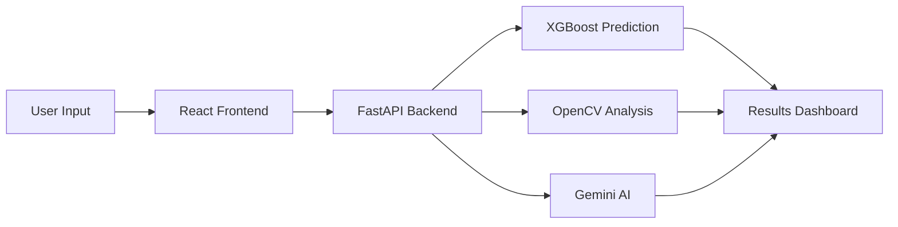

````markdown
# 🌾 AgroAI

> AI-powered agriculture platform for crop yield prediction, crop health analysis, and smart farming assistance using Machine Learning, Computer Vision, and Generative AI.

## Overview

AgroAI is a full-stack intelligent farming platform that assists farmers in making data-driven agricultural decisions. It combines machine learning, computer vision, and generative AI to predict crop yield, analyze plant health, provide farming recommendations, and connect farmers directly with buyers.

---

## Features

- 🌱 Crop Yield Prediction using XGBoost
- 📷 Leaf Disease & Nutrient Deficiency Analysis using OpenCV
- 🤖 AI Farming Assistant powered by Gemini
- 🛒 Farmer-to-Buyer Marketplace
- 📄 PDF Report Generation
- 🌦️ Live Weather Integration
- 🌐 English & Hindi Language Support

---

## Tech Stack

| Layer | Technologies |
|--------|--------------|
| Frontend | React (Vite), Tailwind CSS |
| Backend | FastAPI, Python |
| Machine Learning | XGBoost, Scikit-learn, Pandas, NumPy |
| Computer Vision | OpenCV |
| AI | Google Gemini 2.0 Flash |
| APIs | OpenWeather API |

---

## Architecture

```text
                    AgroAI

      React (Vite) Frontend
               │
          REST API
               │
        FastAPI Backend
      ├── XGBoost Model
      ├── OpenCV Analysis
      ├── Gemini AI
      └── Weather API
```

---

## Project Structure

```text
AgroAI/
│
├── client/
│   ├── src/
│   ├── public/
│   └── package.json
│
├── server/
│   ├── app.py
│   ├── models/
│   ├── utils/
│   ├── requirements.txt
│   └── .env.example
│
└── README.md
```

---

## Workflow



---

## Getting Started

### Clone the Repository

```bash
git clone https://github.com/Rhythem2005/SIH-CROP-YIELD-.git
cd SIH-CROP-YIELD-
```

### Backend Setup

```bash
cd server

python -m venv venv

# Linux / macOS
source venv/bin/activate

# Windows
venv\Scripts\activate

pip install -r requirements.txt

cp .env.example .env

uvicorn app:app --reload
```

Backend runs at:

```
http://127.0.0.1:8000
```

---

### Frontend Setup

```bash
cd client

npm install

npm run dev
```

Frontend runs at:

```
http://localhost:5173
```

---

## Environment Variables

### Server (`server/.env`)

```env
GEMINI_KEY=your_key
OPENWEATHER_KEY=your_key
ALLOWED_ORIGINS=http://localhost:5173
```

### Client (`client/.env`)

```env
VITE_API_URL=http://127.0.0.1:8000
VITE_OPENWEATHER_KEY=your_key
```

---

## API Endpoints

| Method | Endpoint | Description |
|---------|----------|-------------|
| POST | `/predict_yield` | Predict crop yield |
| POST | `/analyze_crop_image` | Analyze crop health |
| POST | `/api/chat` | AI farming chatbot |

---

## Future Improvements

- User Authentication
- CNN-based Disease Detection
- Cloud Deployment
- Mobile Application
- Historical Analytics Dashboard

---

## License

This project is licensed under the **MIT License**.

---

## Author

**Rhythem**

If you found this project useful, consider giving it a ⭐ on GitHub.
````

essive documentation.
